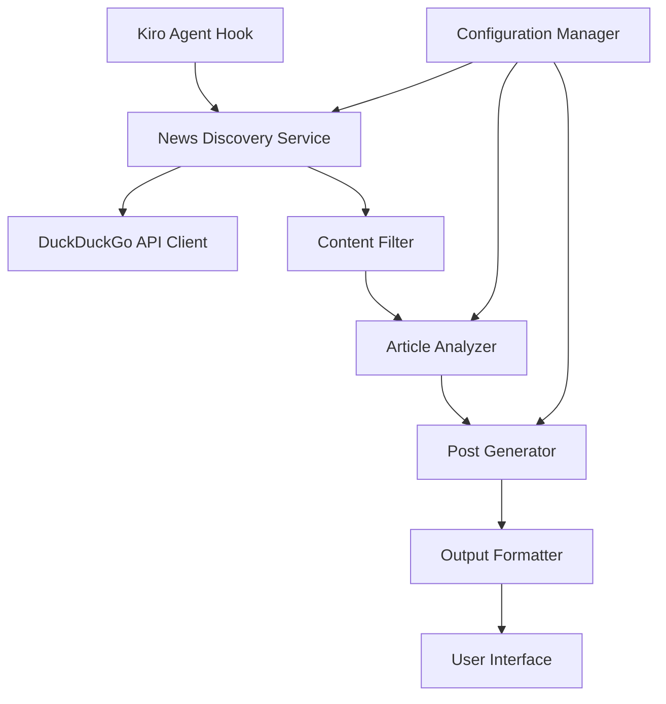

# Design Document

## Overview

The LinkedIn AI News Agent is a Kiro-integrated system that automatically discovers AI-related news using DuckDuckGo's search capabilities and generates professional LinkedIn posts. The system operates entirely within Kiro's environment using free resources and can be triggered through Kiro's agent hook system.

## Architecture

The system follows a modular architecture with clear separation of concerns:



### Core Components

1. **Agent Hook Integration**: Kiro hook that triggers the news discovery process
2. **News Discovery Service**: Orchestrates the entire workflow
3. **DuckDuckGo API Client**: Handles search requests and response parsing
4. **Content Filter**: Filters and ranks articles by relevance and quality
5. **Article Analyzer**: Extracts key insights and determines post-worthy content
6. **Post Generator**: Creates LinkedIn-optimized posts with proper formatting
7. **Configuration Manager**: Handles user preferences and system settings

## Components and Interfaces

### News Discovery Service
```typescript
interface NewsDiscoveryService {
  searchAINews(timeframe: string, topics: string[]): Promise<Article[]>
  filterRelevantArticles(articles: Article[]): Article[]
  generatePosts(articles: Article[]): Promise<LinkedInPost[]>
}
```

### DuckDuckGo API Client
```typescript
interface DuckDuckGoClient {
  search(query: string, timeframe: string): Promise<SearchResult[]>
  parseResults(results: SearchResult[]): Article[]
}
```

### Article Analyzer
```typescript
interface ArticleAnalyzer {
  extractKeyPoints(article: Article): KeyPoint[]
  assessRelevance(article: Article): number
  generateInsights(keyPoints: KeyPoint[]): Insight[]
}
```

### Post Generator
```typescript
interface PostGenerator {
  createEngagingPost(insights: Insight[], style: PostStyle): LinkedInPost
  addHashtags(post: LinkedInPost, topics: string[]): LinkedInPost
  formatForLinkedIn(post: LinkedInPost): string
}
```

## Data Models

### Article
```typescript
interface Article {
  title: string
  url: string
  summary: string
  source: string
  publishedDate: Date
  relevanceScore: number
  keyPoints: KeyPoint[]
}
```

### LinkedInPost
```typescript
interface LinkedInPost {
  content: string
  hashtags: string[]
  sourceUrl: string
  style: PostStyle
  characterCount: number
}
```

### Configuration
```typescript
interface AgentConfig {
  focusAreas: string[]
  postStyle: PostStyle
  triggerSchedule: string
  maxPostsPerRun: number
  sourcePreferences: string[]
}
```

## Error Handling

### API Failures
- Implement retry logic with exponential backoff for DuckDuckGo API calls
- Graceful degradation when search results are limited
- Fallback to cached content when API is unavailable

### Content Quality Issues
- Skip articles that fail quality thresholds
- Provide alternative content suggestions when primary sources fail
- Log quality issues for system improvement

### Rate Limiting
- Respect DuckDuckGo's rate limits with appropriate delays
- Implement request queuing for multiple searches
- Cache results to minimize API calls

## Testing Strategy

### Unit Tests
- Test each service component independently
- Mock external API calls for reliable testing
- Validate post generation with various input scenarios

### Integration Tests
- Test complete workflow from search to post generation
- Verify DuckDuckGo API integration with real requests
- Test Kiro hook integration and triggering

### Content Quality Tests
- Validate generated posts meet LinkedIn standards
- Test hashtag generation and relevance
- Verify character limits and formatting

### Performance Tests
- Measure response times for complete workflow
- Test with various article volumes
- Validate memory usage within Kiro constraints

## Implementation Considerations

### Free Resource Usage
- Use DuckDuckGo's free search API (no authentication required)
- Leverage Kiro's built-in AI capabilities for content analysis
- Minimize external dependencies to reduce costs

### Kiro Integration
- Implement as a Kiro agent hook for seamless integration
- Use Kiro's file system for configuration and caching
- Leverage Kiro's UI components for user interaction

### Content Generation
- Use Kiro's AI model for post generation and analysis
- Implement multiple post styles (news share, insight, question)
- Ensure content follows LinkedIn best practices

### Scalability
- Design for single-user usage within Kiro environment
- Implement efficient caching to reduce API calls
- Structure code for easy feature additions